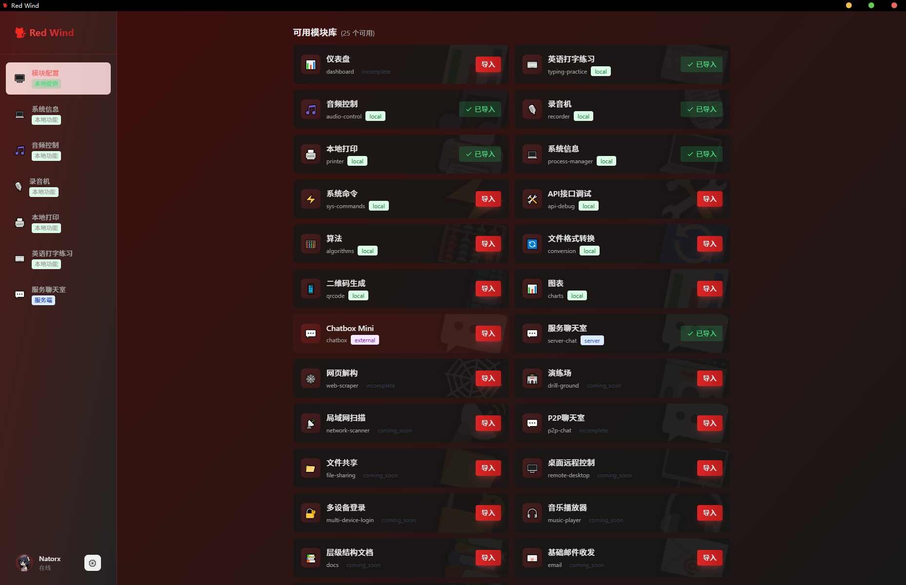
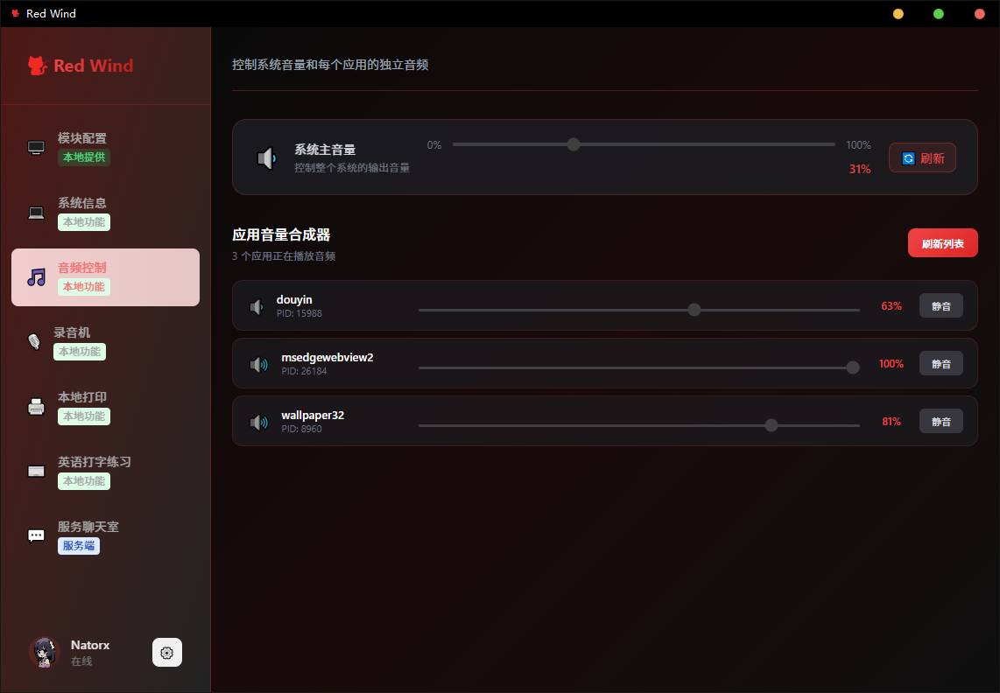
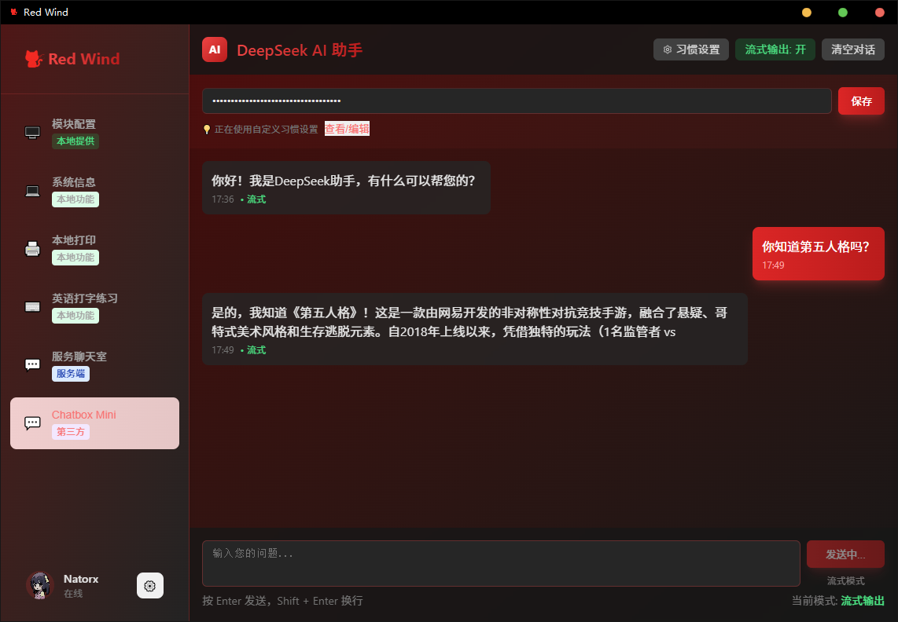
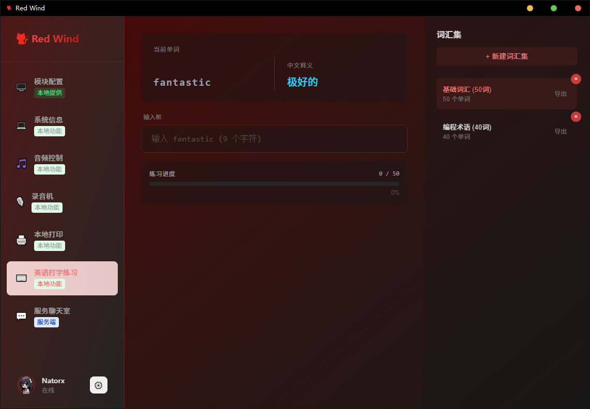
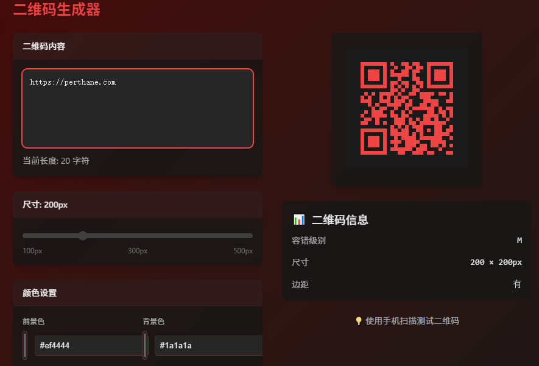
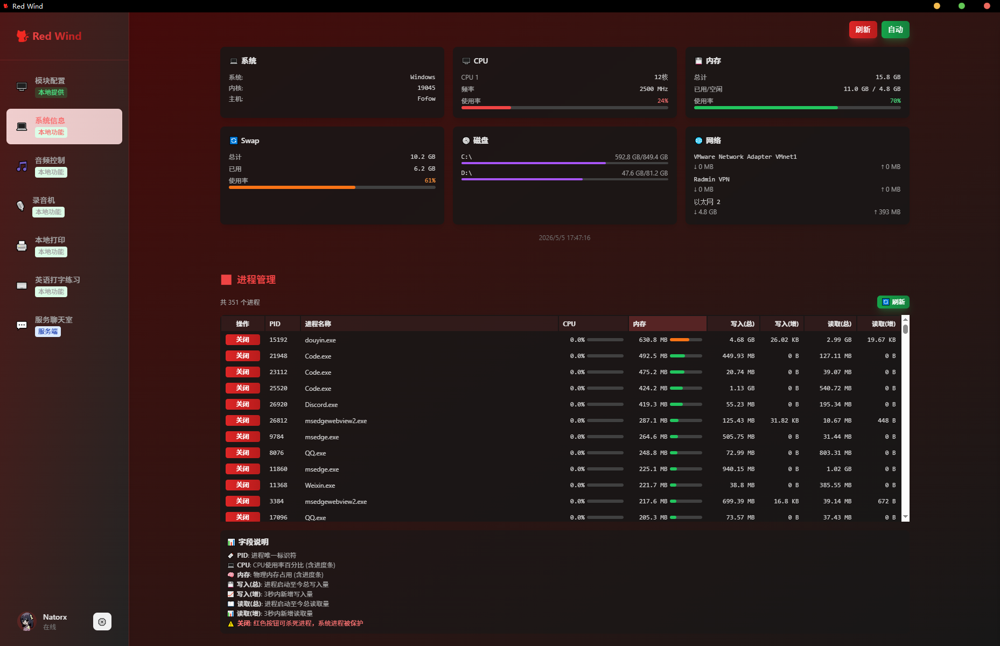

## 项目简介

    红风工具库 —— 集成了一些常用的功能
    Red wind —— a multi functional tool library

- 页面：React+Unocss构建应用
- 业务：Nodejs(fastify)+Rust
- 数据库：SQLite

### 功能

### 技术方案选择
#### 框架
- 框架：传统框架React，灵活且生态丰富。
addition：在了解到svelte之后，有用svelte重构的想法，一款简约高性能的2016年发布且不断完善的框架。
other factors：没有选择sveltekit，因为它自带ssr，大材小用太浪费了
#### UI
- 样式：UnoCSS有比Tailwind更小的打包体积，更灵活的规则，而且支持图标，是我喜欢的原子化CSS写法
- tauri：2022年发布的新技术，极小的打包体积和Rust带来的极高性能，启动快且内存占用低
- 状态管理：rust-sqlite+React Context
#### 业务逻辑层
- Nestjs：SpringBoot相似风格的Nodejs框架，十分好用好上手，涉及到需要服务器的情况就用它。
- Rust：使用Rust对Nest来进行性能提升。
#### 数据访问层
- 我选择使用Prisma，之前考虑过TypeORM
#### 资源管理层
- SQLite：嵌入式关系型数据库，十分轻量，本地数据就用这个了
- PGSQL：支持MySQL和MongoDB中的大部分功能，服务端拿这个存数据

## For dev

### How to Start
    想要运行此项目，你的Nodejs版本需要在24.0.0以上，否则无法运行服务（某些功能无法使用，不过是可以跑起来客户端的），然后`pnpm install`安装依赖，开始运行项目。

`pnpm dev_client`: 运行客户端

`pnpm dev_server`：Fastify服务，提供聊天室等功能

### Run in Linux
在linux mint中，想要启动项目，需要下载依赖
`sudo apt install libwebkit2gtk-4.1-dev libgtk-3-dev build-essential curl wget libssl-dev libayatana-appindicator3-dev librsvg2-dev libglib2.0-dev`
然后启动项目，需要通过commands/linux_dev.sh启动（好像没能成功上传）

### 性能
性能：
LCP：0.26-0.32ms
INP：32ms
全行业 INP 的 中位数 通常在 200-300ms 左右。
优秀需要 < 2.5 秒

### 原理和解决方案

### 语音通讯
- 方案1：可以用Nestjs来传输语音数据，也就是作为信号服务Signaling Server，帮两个客户端找到对方，交换网络地址和通讯号，然后绕过服务器通信。
Tech：Nestjs+WebSocket
- 方案2：使用WebRTC来让两个客户端通过P2P通话，低延迟且不用服务器带宽。
Tech：Rust的saorsa-webrtc等库(DHT网络发现)
方案2会更难，但正是这样才有挑战。

saorsa-webrtc使用QUIC协议通信
难点：
1. 异步Rust代码，需要理解`signaling.rs`,`media.rs`,`call.rs`
2. 库较新，只能看API文档
3. 调试比较难

### React组件通信和状态管理
    想要将一个文件拆开成模块，提高代码可读性，会导致变量不在同一个文件中，无法直接使用的情况，所以需要使用到组件通信。
    在项目中，sidebar就是一个很好的示例
1. ActiveItemProvider是一个状态容器，用它包裹App让整个应用能访问同一个状态的上下文，包裹内的所有组件都可以通过useActiveItem这个hook，从而实现跨组建通信
2. useState是React内置的hook，用于组件内部的状态管理
3. useActiveItem是自定义Hook，用useContext()封装，可以访问全局共享状态。
4. createContext可以创建一个包含上下文的对象
`createContext<T>(defaultValue) `创建上下文，`<Context.Provider value={state}>` 包裹组件树提供数据，子组件用 `useContext(Context)` 获取数据。
5. hooks：以use开头的，可以让韩叔叔组建拥有状态和副作用处理能力的特殊函数
6. 副作用：副作用指的是除了渲染之外的所有操作，包括数据获取，DOM操作，订阅和事件，计时器，日志记录（渲染是主作用，其他的都是副作用）

### Tauri
Tauri的后端本质上就干三件事：
1. 运行一个独立的利用系统自带的Web视图来运行的渲染进程
2. 使用Rust来处理系统级API和业务逻辑，并通过tauri::Builder配置并且给前端通信
3. 利用Rust来以稳定且安全的方式来进行高性能处理。
main.rs中主函数中的tauri::Builder就是应用的配置和启动入口
所以本质上就是运行一个Tauri，然后写的UI被包裹在这个Tauri中，负责应用的视图，作为Tauri的一部分来运行
#### 目录结构
- capabilities：这是一份白名单，定义了这个应用允许的前端窗口和可调用的Rust命令
- gen：生成类型来给前端调用Rust命令和API（自动生成）

#### 调用
在Rust中，被`#[tauri::command]`修饰的函数都叫做命令，可以拿来给前端调用
1. 你需要用`#[tauri::command]`来修饰函数
2. 你需要在main函数中的`.invoke_handler`中注册这个命令

### 项目配置配置
#### UnoCSS
`pnpm i unocss`，然后再Vite和main中导入Unocss样式

项目中使用的preseUno被弃用了

#### Prisma
##### 试错
1. AI说要配置env，但是最新版prisma已经不用env了，AI说要删掉prisma.config.ts，但是实际上是需要的
2. 依赖注入问题
3. 数据库驱动问题
4. 版本匹配问题
5. env环境配置问题
#### 实际使用
1. Nestjs-Prisma官方文档
`pnpm i prisma pg @prisma/client @prisma/adapter-better-sqlite3 @prisma/adapter-pg`
`npx prisma generate`：根据prisma.schema生成TS类型和PrismaClient代码
`npx prisma db push`：把文件给到数据库