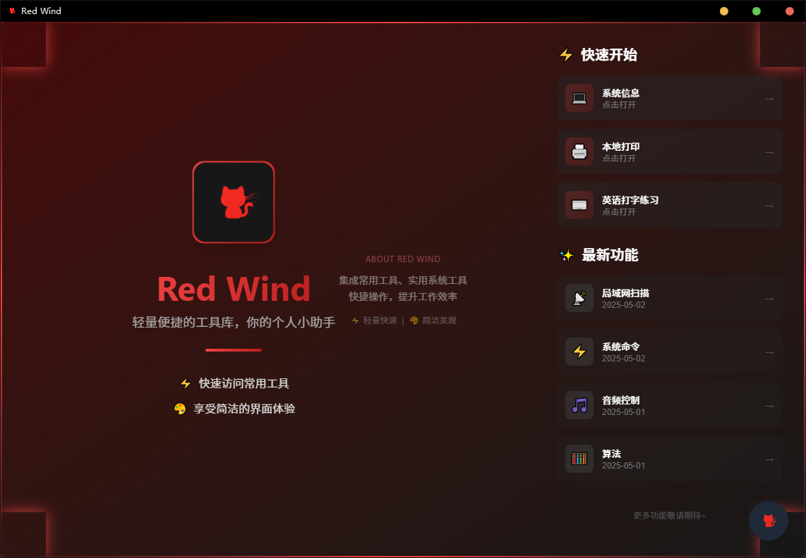
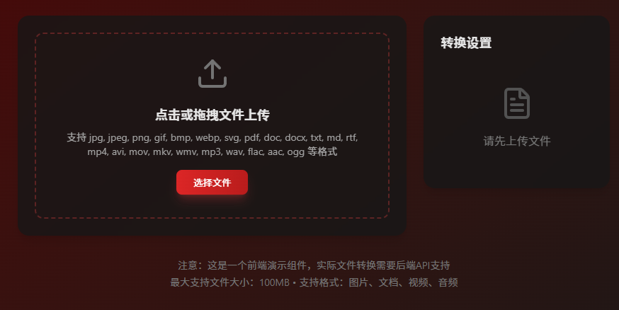
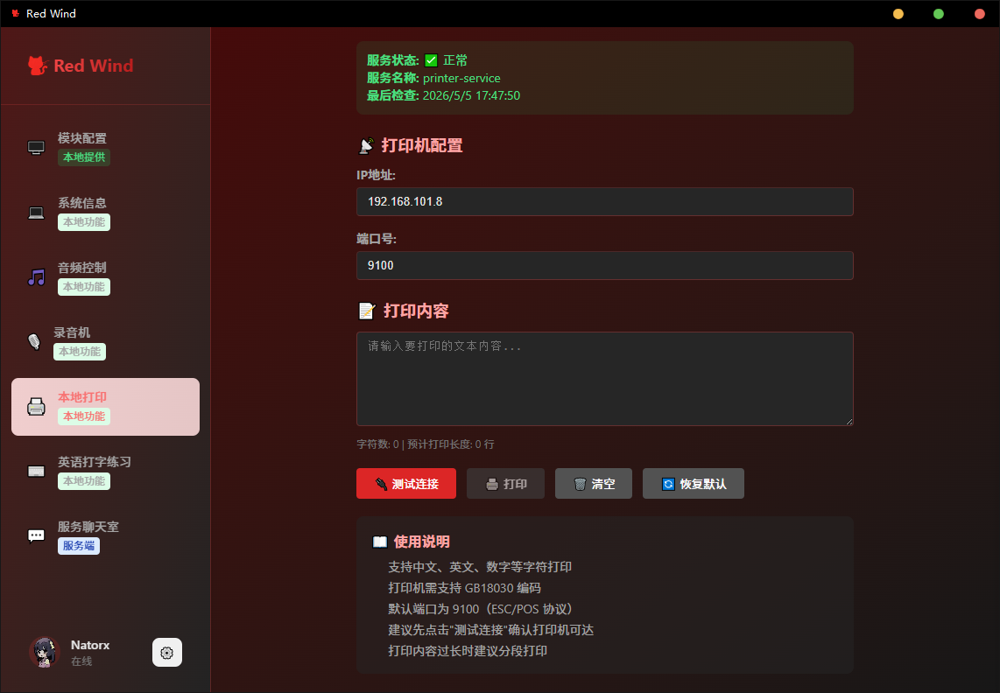

### 项目简介

    红风工具库 —— 集成了一些常用的功能
    Red wind —— a multi functional tool library

- 页面：React+Unocss构建应用
- 业务：Nodejs(fastify)+Rust
- 数据库：SQLite

### 功能

### 功能设计/研究课题
#### 入门级
- [ ✅] 英语打字练习
- [✅] 📊图表
- [✅] 录音机
- [✅] 二维码生成和调用
- [✅] api调试器
- [✅] 打印机调用
- [✅] 文件格式转换
- [✅] chatbox mini
- [✅] 隐藏侧栏
- [✅] 模块配置
- [ ] 二维码的反向解码
- [❌] mini代码编辑器
#### 进阶级
- [half] 网页解构：获取网页中特定元素，也就是爬虫+控制爬虫的UI
- [✅] 常见算法
- [✅] 热力图
- [✅] 设备音量配置
- [ ] 本地配置
- [ ] 局域网共享文件
- [ ] 贴吧
- [half] P2P聊天室(Rust)
- [✅] 聊天室(Node服务)
- [ ] 音乐播放器
#### 挑战级
- [❌] 调用命令行丨已弃用
- [✅] 读硬件配置（主板，内存等）
- [✅] 进程调度查看（任务管理器）
- [✅] 应用指令和快速启动
- [ ] 语音通讯(P2P WebRTC)
- [ ] 基础邮件收发（文本传输+附件传输的P2P模式）
- [ ] 文件共享（上传文件+来源于xx主机的P2P模式）
- [ ] 多设备登录（私钥借用，服务端）
- [ ] 插件扩展
- [ ] 桌面挂件子进程
#### 专家级
- [ ] 桌面远程控制共享

### How to Start
    想要运行此项目，你的Nodejs版本需要在24.0.0以上，否则无法运行服务（某些功能无法使用，不过是可以跑起来客户端的），然后`pnpm install`安装依赖，开始运行项目。

`pnpm dev_client`: 运行客户端
`pnpm dev_server`：Fastify服务，提供聊天室等功能
