## Project Introduction

[简体中文](./README.zh-CN.md)

Red Wind Tool Library —— a multi-functional tool library integrating commonly used features including Deepseek Agent.

After launching the program, you need to configure the required modules yourself. Select "Module Configuration" to try and choose the modules you need from the available module library.

### Features
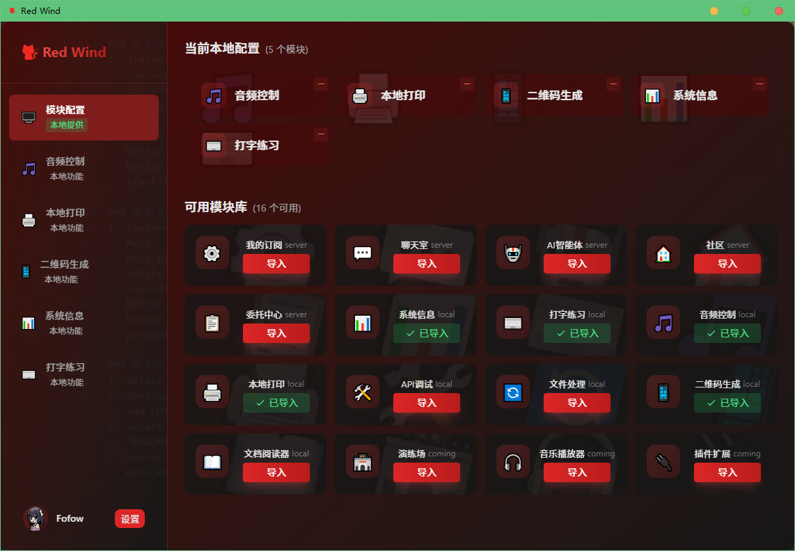
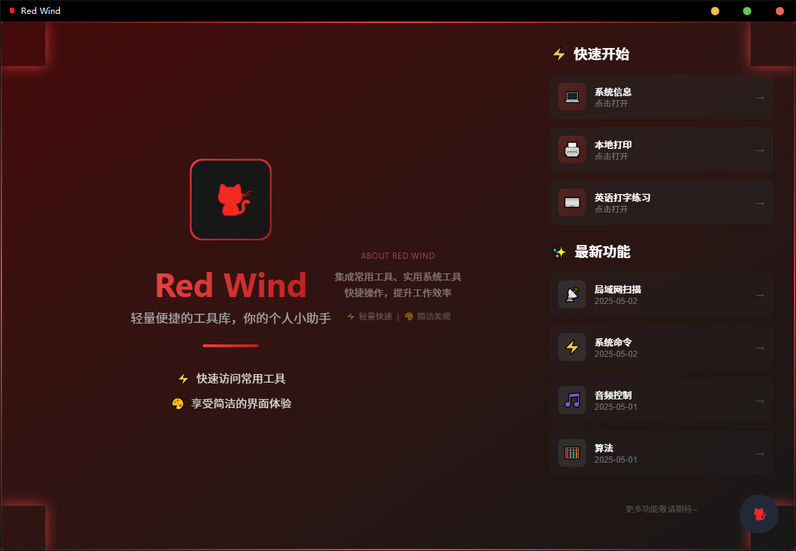
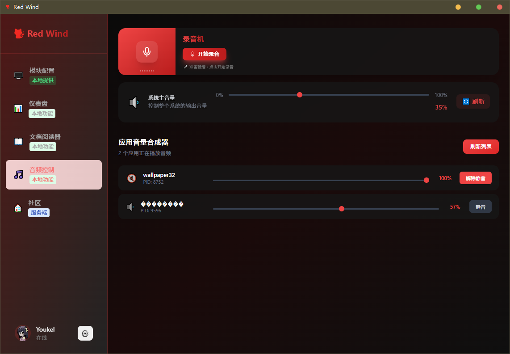
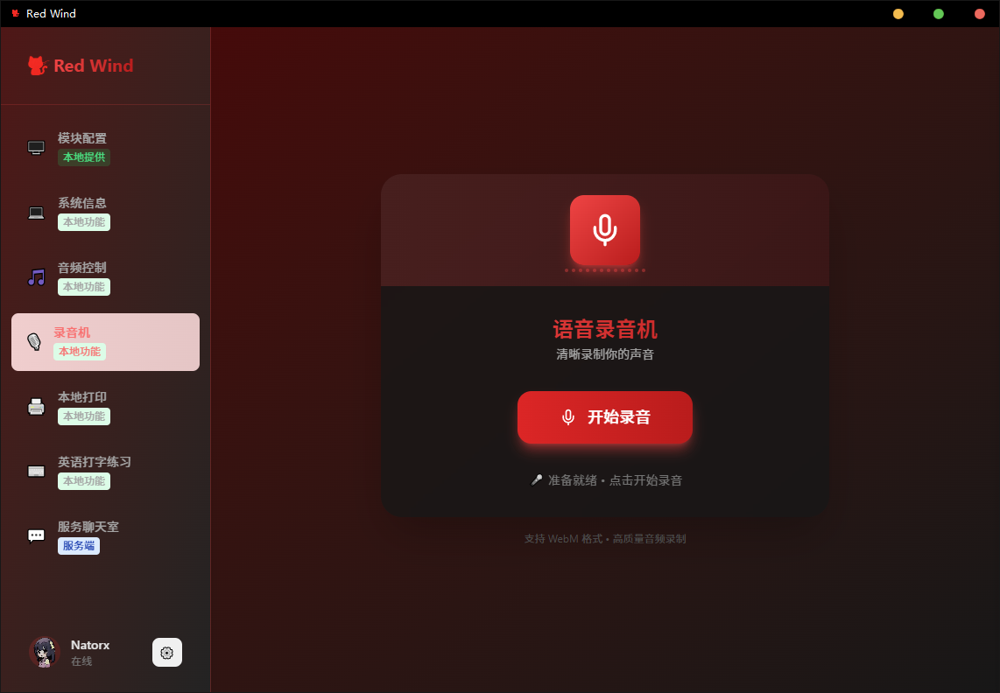
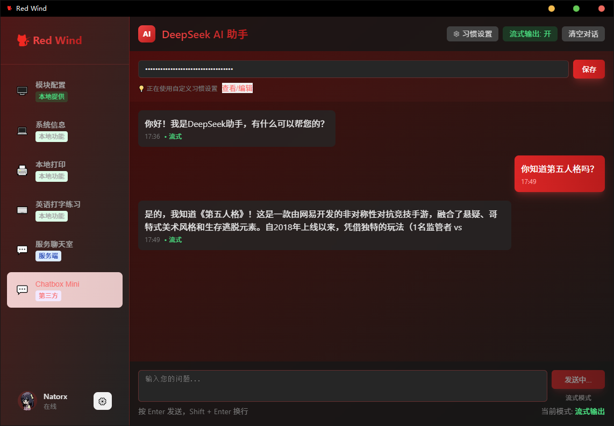
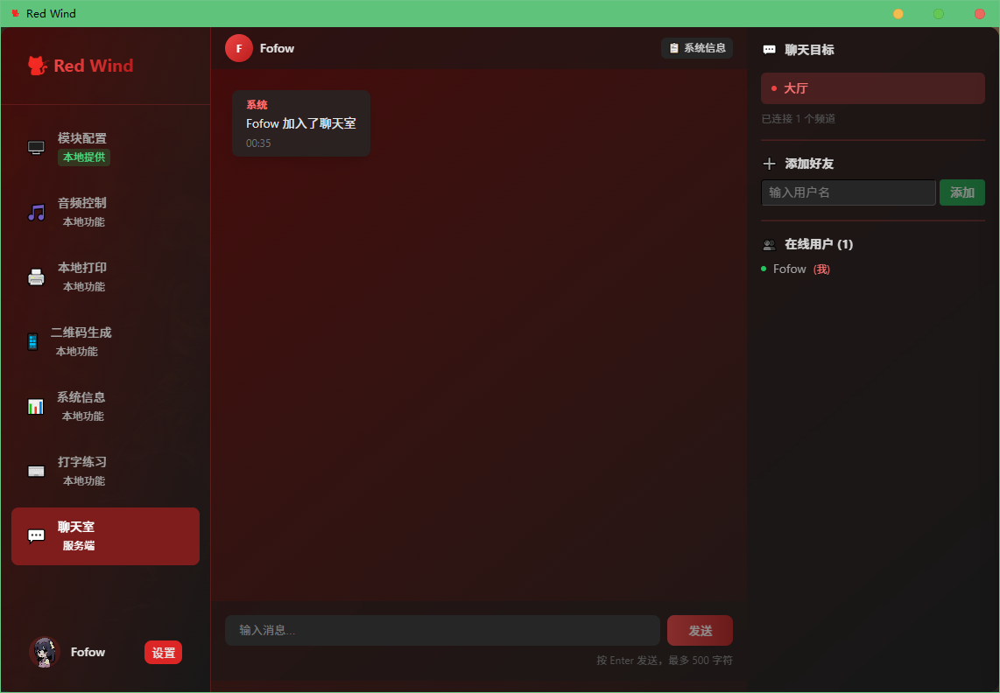
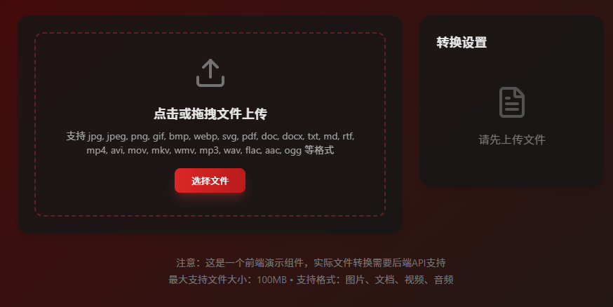
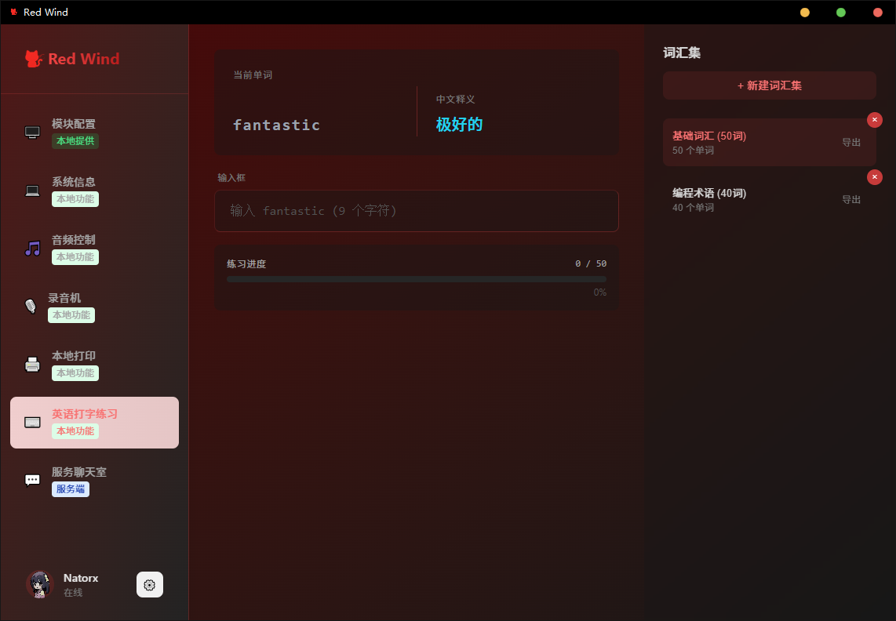

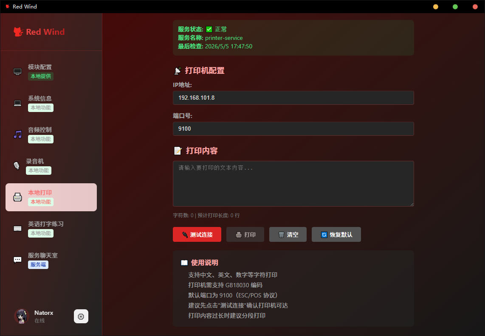
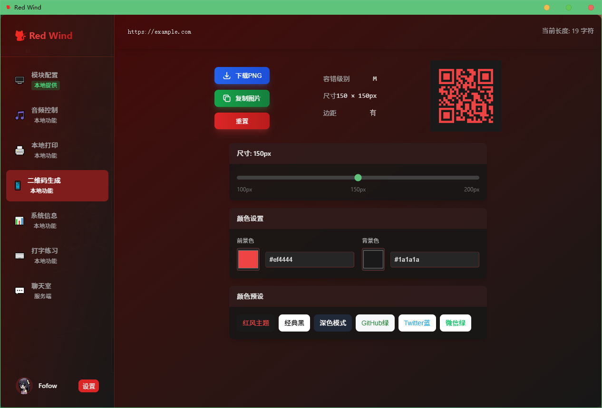
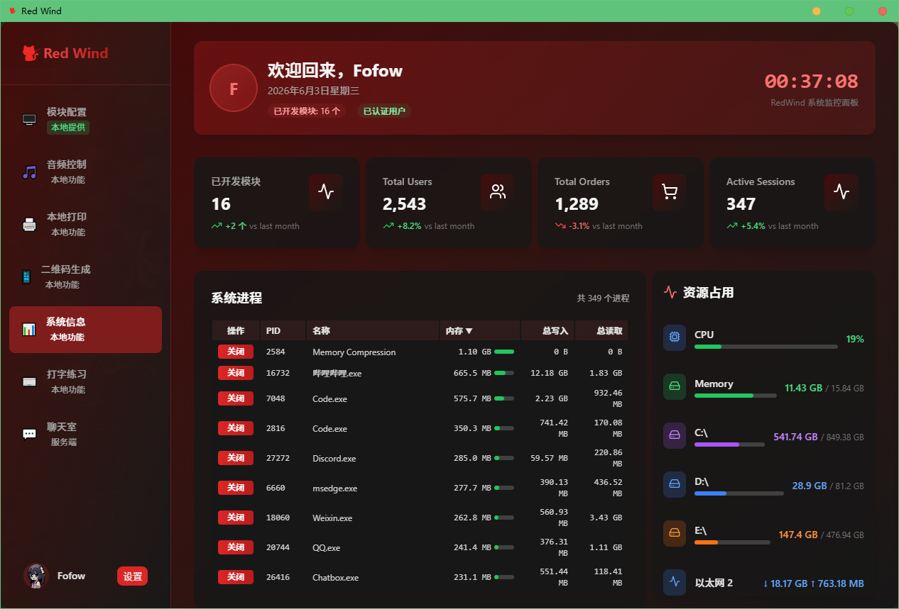

### System Architecture
- Frontend: Developed using React + Unocss + Typescript
- Agent: Integrated with the Deepseekv4 model, with an independent interface service (also includes a separate CLI/GUI) written in Python for the application to call.
- Services: Including chat rooms and posts, all implemented with Fastify (Node.js).
- System: System API calls and program processes are handled by Rust (Tauri).
- Data: Local data is stored using SQLite, managed by the Rust backend; server-side data is stored using PGSQL.
- Performance: High performance is provided by the Rust backend and Rust's WASM.

## For dev

### How to Start
First, ensure you have Node.js (24.0.0+) and Rust installed on your computer. If your Node.js version is lower than 24.0.0, some features will not be available.

`pnpm install` to install the required dependencies.

`pnpm dc`: This is the command to run the main client process. After a successful start, the program will run normally.

`pnpm ds`: Features tagged with `server` all depend on the Node.js service, which provides functions like chat rooms and posts. You need to use `pnpm ds` to start it.

`pnpm agent`: The Agent functionality requires Python. If you want to debug locally, ensure you have Python installed on your computer. Use `pnpm agent` to start the Agent interface service.